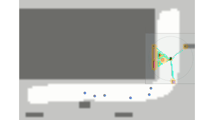
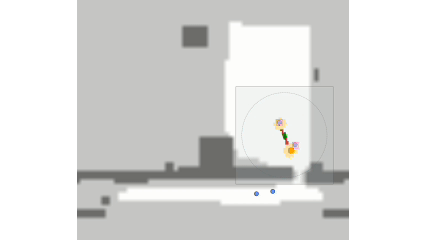
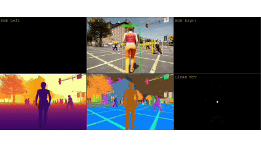

# Follow-Bench 2.0 (Anonymous Code Release)

A benchmark for **socially-aware robot person following (RPF)** in photorealistic
simulation. This anonymous release contains the full evaluation framework, all
planners (model-based + learning-based), perception/ReID stack, and one of our
four scenarios (`random`, i.e., open plaza). Scenario assets, simulator binaries, and pretrained
weights are subject to institutional release approval and will be made public
in the camera-ready version.

## 1. Benchmark motivation and showcase

### 1.1 Existing benchmarks and gaps
- Existing embodied tracking and RPF benchmarks cover important but separate pieces of the task: visual target keeping, offline re-identification, or safety/comfort-oriented planning. None jointly evaluates perception, planning, social interaction, and closed-loop robot motion in photorealistic pedestrian-level scenes.

<table>
  <tr>
    <td align="center" width="25%"><b><a href="https://github.com/wsakobe/TrackVLA">EVT-Bench</a></b></td>
    <td align="center" width="25%"><b><a href="https://github.com/zfw1226/gym-unrealcv">Gym-UnrealCV</a></b></td>
    <td align="center" width="25%"><b><a href="https://medlartea.github.io/tpt-bench/">TPT-Bench</a></b></td>
    <td align="center" width="25%"><b><a href="https://follow-bench.github.io/">Follow-Bench 1.0</a></b></td>
  </tr>
  <tr>
    <td align="center"></td>
    <td align="center"></td>
    <td align="center"></td>
    <td align="center"></td>
  </tr>
</table>

- Follow-Bench 2.0 targets this missing setting with end-to-end, closed-loop RPF in 3D environments, coupling identity recovery, occlusion handling, pedestrian interaction, and motion comfort in one evaluation.

### 1.2 Follow-Bench 2.0 showcase
#### (1) Scenario Diversity
<table>
  <tr>
    <td align="center" width="25%"><b>Street Corner</b></td>
    <td align="center" width="25%"><b>Narrow Passage</b></td>
    <td align="center" width="25%"><b>Cluttered Park</b></td>
    <td align="center" width="25%"><b>Open Plaza</b></td>
  </tr>
  <tr>
    <td align="center"></td>
    <td align="center"></td>
    <td align="center"></td>
    <td align="center"></td>
  </tr>
</table>

#### (2) Embodiment Diversity

- Supports wheeled, quadruped, and humanoid platforms.

<p align="center">
  
</p>

- Humanoid robot navigation in different scenarios.

<table>
  <tr>
    <td align="center"></td>
    <td align="center"></td>
    <td align="center"></td>
  </tr>
</table>

#### (3) Crowd Density Control

<table>
  <tr>
    <td align="center" width="33%"><b>8 pedestrians</b></td>
    <td align="center" width="33%"><b>12 pedestrians</b></td>
    <td align="center" width="33%"><b>16 pedestrians</b></td>
  </tr>
  <tr>
    <td align="center"></td>
    <td align="center"></td>
    <td align="center"></td>
  </tr>
  <tr>
    <td align="center" width="33%"><b>20 pedestrians</b></td>
    <td align="center" width="33%"><b>24 pedestrians</b></td>
    <td align="center" width="33%"><b>28 pedestrians</b></td>
  </tr>
  <tr>
    <td align="center"></td>
    <td align="center"></td>
    <td align="center"></td>
  </tr>
</table>

#### (4) Crowd Flow Control

<table>
  <tr>
    <td align="center" width="33%"><b>Parallel</b></td>
    <td align="center" width="33%"><b>Perpendicular</b></td>
    <td align="center" width="33%"><b>Chaotic</b></td>
  </tr>
  <tr>
    <td align="center"></td>
    <td align="center"></td>
    <td align="center"></td>
  </tr>
</table>

#### (5) Environmental Stressor Control

- Same cluttered-park scene and viewpoint under different environmental conditions.

<table>
  <tr>
    <td align="center" width="20%"><b>Clear</b></td>
    <td align="center" width="20%"><b>Cloud</b></td>
    <td align="center" width="20%"><b>Rain</b></td>
    <td align="center" width="20%"><b>Fog</b></td>
    <td align="center" width="20%"><b>Dusk</b></td>
  </tr>
  <tr>
    <td align="center"></td>
    <td align="center"></td>
    <td align="center"></td>
    <td align="center"></td>
    <td align="center"></td>
  </tr>
</table>

- Real-time environmental control across different scenarios.

<table>
  <tr>
    <td align="center" width="33%"><b>Street Corner</b></td>
    <td align="center" width="33%"><b>Narrow Passage</b></td>
    <td align="center" width="33%"><b>Open Plaza</b></td>
  </tr>
  <tr>
    <td align="center"></td>
    <td align="center"></td>
    <td align="center"></td>
  </tr>
</table>

#### (6) Visualization and Diagnostics
***Note:** robot controlled by `rda_traj`, not manual teleoperation.*

- The 2D grid-map view visualizes the robot (green box), target person (orange circle), pedestrians (blue circles), planned trajectory (red curve), navigation goal (red cross), and the robot's live local map, including occupancy grids and ESDF fields.

<table>
  <tr>
    <td align="center"></td>
    <td align="center"></td>
    <td align="center"></td>
  </tr>
</table>

- Robot-egocentric RGB views under different weather conditions.

<table>
  <tr>
    <td align="center" width="33%"><b>Clear</b></td>
    <td align="center" width="33%"><b>Rain</b></td>
    <td align="center" width="33%"><b>Fog</b></td>
  </tr>
  <tr>
    <td align="center"></td>
    <td align="center"></td>
    <td align="center"></td>
  </tr>
</table>

- Multi-modal perception visualization.

<div align="center">
<table>
  <tr>
    <td align="center"><b>Street Corner</b></td>
  </tr>
  <tr>
    <td align="center"></td>
  </tr>
  <tr>
    <td align="center"><b>Open Plaza</b></td>
  </tr>
  <tr>
    <td align="center"></td>
  </tr>
  <tr>
    <td align="center"><b>Night Doorway</b></td>
  </tr>
  <tr>
    <td align="center"></td>
  </tr>
</table>
</div>

- Some Demonstrations

<table>
  <tr>
    <td align="center" width="33%"><b>Narrow Passage / Clear</b></td>
    <td align="center" width="33%"><b>Open Plaza / Rain</b></td>
    <td align="center" width="33%"><b>Cluttered Park / Clear</b></td>
  </tr>
  <tr>
    <td align="center"></td>
    <td align="center"></td>
    <td align="center"></td>
  </tr>
</table>

<table align="center">
  <tr>
    <td align="center"><b>rda_traj / Back Following</b></td>
  </tr>
  <tr>
    <td align="center"></td>
  </tr>
  <tr>
    <td align="center"><b>rda_search / Back Following</b></td>
  </tr>
  <tr>
    <td align="center"></td>
  </tr>
</table>


## 2. Directory layout

```
followbench2.0-light/
├── README.md                           # this file (only doc in the release)
├── environment.yml                     # conda env (Python 3.10, CARLA 0.9.16)
├── .gitignore
└── scenario/
    ├── debug_vis/                      # 2D top-down visualiser (live overlay)
    ├── evaluation/                     # metrics, schemas, collision logging
    │   ├── core/                       #   logger, collision monitor, scoring
    │   └── visualization/              #   replay + plot utilities
    ├── map_annotator/                  # nav-mesh + ROI flow-point editor
    ├── planners/                       # all follower policies + perception
    │   ├── adapters/                   #   planner adapters (FollowerPolicyAdapter)
    │   ├── behavior/                   #   side-follow, search-state machinery
    │   ├── common/                     #   maps, prediction, utilities
    │   ├── learning_based/
    │   │   ├── trackvla/               #   end-to-end VLA baseline (re-impl.)
    │   │   └── oa-vat/                 #   YOLOe + ORTrack + DINOv3 ReID baseline (re-impl.)
    │   ├── perception/                 #   GT / sensor (RGB-D + LiDAR) frontends
    │   ├── planning/                   #   PID, SFM, DWA, RDA, BSO-HFC kernels
    │   ├── prediction/                 #   trajectory predictors (CVKF, S-GAN, …)
    │   ├── tests/                      #   unit / smoke tests
    │   ├── traj_predictor/             #   trained checkpoints loader
    │   └── vendors/                    #   vendored RDA-planner (do not modify)
    ├── target_identification/          # appearance ReID (basic + KPR/SOLIDER)
    │   ├── reid_kpr/                   #   vendored deep_person_reid + KPR
    │   ├── reid_model/                 #   our ResNet-based extractor
    │   ├── states/                     #   FSM (Initial → Tracking → Reid)
    │   └── reid_classifier.py          #   online Ridge confidence head
    ├── random/                         # the only scenario in this release
    │   ├── runner/                     #   episode manager (shared main loop)
    │   ├── core_types.py               #   FollowObservation / RobotState / NpcState
    │   ├── robot_runtime.py            #   robot spawn + sensor harness
    │   ├── pedestrian_sfm.py           #   social-force NPC controller
    │   ├── visibility_instance.py      #   instance-mask visibility check
    │   ├── carla_roi_crowd_runner.py   #   crowd flow inside ROI
    │   └── run_episode_manager.sh      #   one-line launcher
    └── weight_paths.py                 # repo-relative weight resolution helper
```

The other three scenarios (`narrow passage`, `cluttered park`, `street corner`) share the same
manager/runtime under `scenario/random/runner/`; their assets and launch
scripts are withheld for the anonymous review and released in the
camera-ready version.

---

## 3. Setup

### 3.1 Simulator

We use Unreal Engine (UE) with a custom NavMesh + crowd-flow extension. The
custom build, walker assets, and pretrained weights are part of the
**institutional release** — we will publish them alongside the camera-ready
paper. For review, only the code in this repository is available.

If you have access to a stock UE install, the framework imports and
unit tests will run; full-scenario simulation additionally needs our
walker / NavMesh assets.

### 3.2 Python environment

```bash
conda env create -f environment.yml
conda activate followbench

# KPR ReID needs two source-only packages:
pip install "segment_anything @ git+https://github.com/facebookresearch/segment-anything"
pip install "cosine_annealing_warmup @ git+https://github.com/katsura-jp/pytorch-cosine-annealing-with-warmup"
```

### 3.3 Weights layout

Place pretrained weights under `data/weights/` (kept out of this release):

```
data/
├── weights/
│   ├── yolo/                yolo11s.pt, yoloe-11l-seg.pt
│   ├── reid_basic/          ckpt.t7
│   ├── reid_kpr/            kpr_*.pth.tar
│   └── traj_predictor/      sgan.pt, csgan.pt
├── trackvla/                checkpoint-* (Qwen3-4B + SigLIP + DINOv3)
└── oa-vat/
    ├── dinov3/              dinov3_vit{b16,s16}_*.pth
    ├── ortrack/             ORTrack_ep0300.pth.tar
    ├── yolo/                yoloe-11l-seg.pt
    └── mobileclip_blt.ts
```

`scenario/weight_paths.py` resolves all paths relative to the repo root, so no
path editing is required.

---

## 4. Quick start

### 4.1 Run a demo episode (random scenario)

```bash
cd followbench2.0-light
PLANNER=pid FOLLOW_POSITION=back ./scenario/random/run_episode_manager.sh
```

Useful environment overrides (consumed by `run_episode_manager.sh`):

| Var                | Default | Purpose                                           |
|--------------------|---------|---------------------------------------------------|
| `PLANNER`          | `pid`   | follower policy (see §5 table)                    |
| `FOLLOW_POSITION`  | `back`  | `back`, `left_side`, `right_side`                 |
| `DESIRED_DISTANCE` | `1.5`   | metres between robot and target                   |

Pass any other CLI flag through; e.g. enable the perception frontend that
decouples planners from GT:

```bash
PLANNER=rda ./scenario/random/run_episode_manager.sh \
    --use-perception --reid-mode kpr
```

### 4.2 Direct Python entry-point

```bash
conda run -n followbench python scenario/random/runner/run_episode_manager.py --help
```

`build_parser()` at the top of `run_episode_manager.py` is the authoritative
list of every CLI flag.

### 4.3 Evaluation

After one or more episodes finish, compute aggregated metrics:

```bash
conda run -n followbench python scenario/evaluation/core/score.py \
    --runs-glob "scenario/random/runs/2026*/episode.json" \
    --out scenario/evaluation/results/random_summary.csv
```

Schemas, collision logic, and scoring are in `scenario/evaluation/core/`.

### 4.4 Live debug visualiser

Add `--debug` to any `run_episode_manager.py` call to launch the 2D top-down
visualiser in a side process. Source under `scenario/debug_vis/`.

---

## 5. Available planners and follow settings

Follow-Bench 2.0 ships **8 follower policies** spanning three paradigms:
modular (BEV perception → motion planner), end-to-end vision-language-action
(VLA), and foundation-model-based tracking + low-level control. All policies
implement the same `FollowerPolicyAdapter` ABC
(`scenario/random/follow_policy_adapter.py`) with `reset()` and `act()`.

| Paper name             | CLI                       | Paradigm     | Perception input         | Follow position | Origin                              |
|------------------------|---------------------------|--------------|--------------------------|-----------------|-------------------------------------|
| **SFM** [3]            | `--planner sfm`           | Modular (MB) | BEV (Track + ReID)       | back / side     | Ferrer *et al.* 2013 [3]            |
| **DWA** [4]            | `--planner dwa_traj`      | Modular (MB) | BEV (Track + ReID)       | back / side     | Van Dang *et al.* 2022 [4]          |
| **MPC** [5]            | `--planner rda`           | Modular (MB) | BEV (Track + ReID)       | back / side     | Han *et al.* (RDA) 2023 [5]         |
| **MPC w/ Traj.** [6]   | `--planner rda_traj`      | Modular (MB) | BEV + traj. forecast     | back / side     | Sekiguchi *et al.* 2021 [6]         |
| **MPC + DS** [7]       | `--planner rda_search`    | Modular (MB) | BEV + field-based search | back / side     | Ye *et al.* (RPF-Search) 2025 [7]   |
| **BSO-HFC** [8]        | `--planner bso_hfc`       | Modular (MB) | BEV (Track + ReID)       | back / side     | Lyu *et al.* 2025 [8]               |
| **TrackVLA** [1]       | `--planner trackvla`      | End-to-end VLA (LB)              | front RGB + language    | back            | Wang *et al.* 2025 [1]; reproduced on OpenTrackVLA [9] with Qwen3-4B [10] |
| **OA-VAT** [2]         | `--planner oa_vat`        | Foundation-model + PID      | front RGB               | back            | Sun *et al.* 2026 [2]               |

The default planner is `rda_traj` ("MPC w/ Traj.").

**References for the table above.**

[1] S. Wang *et al.*, "TrackVLA: Embodied Visual Tracking in the Wild," *Conference on Robot Learning (CoRL)*, 2025. *(TrackVLA)*

[2] H. Sun *et al.*, "Instance-level Visual Active Tracking with Occlusion-Aware Planning," *arXiv preprint arXiv:2604.21453*, 2026. SOTA in EVT-Bench and DAT, accepted by CVPR 2026. *(OA-VAT)*

[3] G. Ferrer, A. Garrell, and A. Sanfeliu, "Robot Companion: A Social-Force Based Approach with Human Awareness-Navigation in Crowded Environments," *IROS*, pp. 1688–1694, 2013. *(SFM)*

[4] C. Van Dang, H. Ahn, J.-W. Kim, and S. C. Lee, "Collision-Free Navigation in Human-Following Task Using a Cognitive Robotic System on Differential-Drive Vehicles," *IEEE Trans. Cogn. Develop. Syst.*, vol. 15, no. 1, pp. 78–87, 2022. *(DWA)*

[5] R. Han *et al.*, "RDA: An Accelerated Collision-Free Motion Planner for Autonomous Navigation in Cluttered Environments," *IEEE Robot. Autom. Lett.*, vol. 8, no. 3, pp. 1715–1722, 2023. *(MPC)*

[6] S. Sekiguchi *et al.*, "Uncertainty-Aware Non-Linear Model Predictive Control for Human-Following Companion Robot," *ICRA*, pp. 8316–8322, 2021. *(MPC w/ Traj.)*

[7] H. Ye, K. Cai, Y. Zhan, B. Xia, A. Ajoudani, and H. Zhang, "RPF-Search: Field-Based Search for Robot Person Following in Unknown Dynamic Environments," *IEEE/ASME Trans. Mechatronics*, vol. 30, no. 6, pp. 4129–4141, 2025. *(MPC + DS)*

[8] H. Lyu and W. Wu, "A Robust Human-Following System for Autonomous Mobile Robot in Unknown Environments," *IEEE Sensors J.*, 2025. *(BSO-HFC)*

[9] K. Lee, H. Ying, and T. Zhao, "OpenTrackVLA: Open-Source Visual Language Action Model for Visual Navigation and Following," GitHub repository, 2025. <https://github.com/om-ai-lab/OpenTrackVLA>

[10] A. Yang *et al.*, "Qwen3 Technical Report," *arXiv preprint arXiv:2505.09388*, 2025.

[11] Y. Zhang *et al.*, "ByteTrack: Multi-Object Tracking by Associating Every Detection Box," *ECCV*, 2022.

[12] H. Ye, J. Zhao, Y. Zhan, W. Chen, L. He, and H. Zhang, "Person Re-Identification for Robot Person Following with Online Continual Learning," *IEEE Robot. Autom. Lett.*, 2024. *(Target-ReID)*

[13] P. Dendorfer *et al.*, "MOT20: A Benchmark for Multi Object Tracking in Crowded Scenes," *arXiv preprint arXiv:2003.09003*, 2020. *(ResNet-18 ReID baseline)*

[14] V. Somers, A. Alahi, and C. De Vleeschouwer, "Keypoint Promptable Re-Identification," *ECCV*, pp. 216–233, 2025. *(KPR)*

[15] S. Bai *et al.*, "Qwen3-VL Technical Report," *arXiv preprint arXiv:2511.21631*, 2025. *(target-prompt VLM)*

**Modular tracking module.** Following TPT-Bench (see §6), every modular policy
shares a common BEV perception frontend that combines **ByteTrack [11]** with
**Target-ReID [12]**. The ReID backbone is selectable:

```bash
--use-perception --reid-mode {basic,kpr}
```

* `basic` — ResNet-18 extractor [13] (lightweight)
* `kpr`   — Keypoint Promptable ReID with SOLIDER-Swin [14] (occlusion-robust)

Under back-following the perception frontend uses the front RGB-D camera
only; under side-following the same pipeline runs independently on the
front, left, and right RGB-D cameras and fuses tracks at the field-of-view
overlap. The end-to-end policies (`trackvla`, `oa_vat`) carry their own
perception and ignore `--use-perception`.

**Follow positions.** `back` (logistics, patrol, visually-guided following)
and `left_side` / `right_side` (socially-aware abreast follow). Target-route
lane bias:

```bash
--target-lane-bias-mode {right_hand, leave_follow_side_clear}
```

**Initial-frame target specification.** Each episode begins with a
first-frame bounding box of the target. Modular and OA-VAT policies use the
box to initialise their tracker / ReID; TrackVLA converts the cropped patch
into a language description with **Qwen3-VL [15]** and feeds it as the
policy prompt (e.g., *"follow the woman wearing a blue T-shirt and white
shorts."*).

---

## 6. Comparison with prior benchmarks

We position Follow-Bench 2.0 along three capability axes required by
socially-aware RPF: **target re-identification**, **obstacle / occlusion
avoidance**, and **socially-aware following**.

<!-- markdown rendering of the comparison table; LaTeX source kept below -->

| Benchmark                             | ReID | Avoid. | Social | Follow Conf. | MB | E2E | Eval. type        | Ped. interaction                          | Engine            |
|---------------------------------------|:----:|:------:|:------:|--------------|:--:|:--:|-------------------|-------------------------------------------|-------------------|
| EVT-Bench [1]                         | Mid  | Mid    | Low    | Back         |    | ✓  | task-level        | ORCA*                                     | Habitat 3.0       |
| Gym-UnrealCV [2]                      | Low  | Low    | Low    | Back         |    | ✓  | task-level        | NavMesh                                   | Unreal Engine     |
| DAT (aerial) [3]                      | Low  | Low    | Low    | Back         |    | ✓  | task-level        | NavMesh                                   | Unreal Engine     |
| TPT-Bench [4]                         | High | —      | —      | —            | —  | —  | perception-level  | real traj. (offline)                      | real-world seq.   |
| Follow-Bench 1.0 [5]                  | —    | High   | Mid    | Back+Side    | ✓  |    | planning-level    | SFM / ORCA                                | 2D simulator      |
| **Follow-Bench 2.0 (ours)**           | Mid  | High   | High   | Back+Side    | ✓  | ✓  | task-level        | NavMesh + SFM/ORCA + social activities    | Unreal Engine     |

``--'' denotes out-of-scope axes. E2E denotes end-to-end visual or VLA policies. 
    ORCA* follows EVT-Bench's ORCA-based avoidance setting, although penetration may still occur in dense mesh-agent interactions.

**References for the table above.**

[1] S. Wang *et al.*, "TrackVLA: Embodied Visual Tracking in the Wild," *Conference on Robot Learning (CoRL)*, 2025. *(EVT-Bench / TrackVLA)*

[2] W. Qiu *et al.*, "UnrealCV: Virtual Worlds for Computer Vision," *Proc. 25th ACM Int. Conf. Multimedia*, pp. 1221–1224, 2017. *(Gym-UnrealCV)*

[3] H. Sun *et al.*, "Open-World Drone Active Tracking with Goal-Centered Rewards," *Advances in Neural Information Processing Systems (NeurIPS)*, 2025. *(DAT)*

[4] H. Ye *et al.*, "TPT-Bench: A Large-Scale, Long-Term and Robot-Egocentric Dataset for Benchmarking Target Person Tracking," *arXiv preprint arXiv:2505.07446*, 2025. Accepted by International Journal of Robotics Research 2026. *(TPT-Bench)*

[5] H. Ye *et al.*, "Follow-Bench: A Unified Motion Planning Benchmark for Socially-Aware Robot Person Following," *arXiv preprint*, 2025. *(Follow-Bench 1.0)*

---


## 7. Architectural notes

* Every planner inherits from `FollowerPolicyAdapter` (`reset() / act()`).
* New planners are registered in
  `scenario/random/runner/run_episode_manager.py` under the `--planner`
  argparse choices.
* Planners that expose debug info to the visualiser implement
  `get_debug_info() -> dict` returning `obstacles` and `traj_points`.
* Files under `scenario/planners/vendors/` are vendored third-party code
  (RDA-planner) and are never modified in-tree.
* The 2D debug visualiser in `scenario/debug_vis/` runs in a separate
  process and is non-blocking by design.

---
